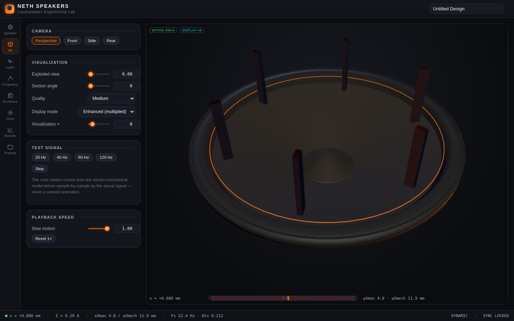

# NETH SPEAKERS

**A professional loudspeaker design & electroacoustic simulation laboratory — in your browser.**

Neth Speakers combines a parametric 3D speaker CAD workspace, a coupled electro-mechanical
speaker physics engine, and a real-time audio simulation lab. Design a driver from scratch,
build an enclosure, upload a music file, and watch the cone physically move in response to
the *actual audio signal* — processed through the same state-space model that produces every
curve in the app.



---

## Feature overview

| Workspace | What it does |
|---|---|
| **Speaker Lab** | Design overview: live Thiele–Small parameters (Fs, Qms, Qes, Qts, Vas, Bl, Re, Le, Sd, Mms, Cms, Xmax…), free-air SPL / impedance / excursion curves, demo-driver presets. |
| **3D Simulator** | Real-time axial cone motion from the physical model. Orbit camera, front/side/rear views, exploded view, section clipping, quality tiers, slow motion, signed displacement readout in mm, ±Xmax / ±Xmech warning. |
| **Audio Lab** | Upload MP3/WAV/OGG/FLAC (stays on your device), waveform with L/R channels, transport with seek and loop regions, spectrum analyzer, amplifier voltage/power/clipping/current-limit modeling, channel and band selection, rolling displacement timeline, sync indicator. |
| **Frequency Lab** | Sine / log & linear sweep / stepped / multi-tone / pink & white noise / tone burst / impulse generators, SPL-impedance-excursion-current-power plots with live cursor readouts, and an independent **time-domain verification** of the analytical curves. |
| **Enclosure Designer** | Sealed / ported / passive-radiator systems: volumes, port tuning (Helmholtz + end correction), Fc/Qtc, port air-speed warning, damping fill, bracing, multi-driver wiring, cutaway 3D with adjustable transparency, sealed-vs-ported-vs-PR response comparison. |
| **Parts Editor** | Component-level editing: cone (geometry, material, profile, dust cap, finish), surround (rolls, stiffness), spider (corrugations, stiffness, damping), voice coil (former, wire, layers, turns, temperature, overhung/underhung, Re/Le overrides), magnet assembly (ferrite/neodymium, stack, plates, gap, leakage, Bl/B overrides), frame, nonlinearity coefficients. |
| **Results** | Overlay multiple designs on SPL / impedance / excursion plots, side-by-side parameter table, text report export, CSV export on every plot. |
| **Projects** | Save/load/duplicate/rename/delete designs (IndexedDB), JSON import/export, custom materials database. |

Every control affects the underlying model — there are no fake controls.

## Self-balancing design

Every parameter you edit passes through a physics sanitizer (`src/physics/validate.ts`):
NaN or out-of-range values are replaced with safe ones, and interdependent values
re-balance automatically — the surround always lands on the cone edge, the coil
always fits the magnetic gap, the magnet always covers the top plate, the spider
always bonds to the former, the frame always houses the motor, the port always fits
the box, and Xmax can never exceed Xmech. It is impossible to break the simulation
by typing extreme values; the design bends instead of breaking.

## Quick start

```bash
npm install
npm run dev        # → http://localhost:3000
```

Other scripts:

```bash
npm run build      # type-check + production build (dist/)
npm run preview    # serve the production build
npm test           # run the physics validation suite (vitest, 31 tests)
```

Requires a modern browser (Chrome / Edge / Firefox / Safari 14.1+, iPad supported).
No GPU server, account, or paid API is needed — everything runs locally.

## Architecture

```
src/
├── physics/          # pure, UI-free engine (same model powers everything)
│   ├── types.ts        # parameter & result schemas (SI units internally)
│   ├── units.ts        # conversions & constants
│   ├── materials.ts    # material database (density, resistivity, Br, μr…)
│   ├── winding.ts      # wire length / Re / winding height from geometry
│   ├── magnet.ts       # 1-D magnetic-circuit approximation (B, Bl)
│   ├── tsp.ts          # Thiele–Small parameter derivation
│   ├── stateSpace.ts   # coupled electro-mechanical(-acoustic) state-space model
│   │                   #   + ZOH discretization (block matrix exponential)
│   ├── freqresp.ts     # H(jω) evaluation, impedance, enclosure calcs,
│   │                   #   time-domain verification utilities
│   ├── amplifier.ts    # voltage/power drive, load impedance, wiring
│   ├── dsp.ts          # discrete filter runner + test-signal generators
│   └── defaults.ts     # demo drivers & factory settings
├── audio/
│   ├── engine.ts       # AudioContext, transport, decode, routing, worklet bridge
│   └── sync.ts         # audio-clock sync + render extrapolation (pure, tested)
├── three/
│   ├── geometry.ts     # parametric lathe-based driver + enclosure geometry,
│   │                   #   per-frame surround/spider/lead deformation
│   └── speakerScene.ts # renderer, camera, controls, clipping, exploded view
├── storage/
│   ├── db.ts           # IndexedDB (+ localStorage fallback)
│   └── project.ts      # project schema, validation, import/export
├── components/         # UI primitives: plots, sliders, 3D viewport wrapper
├── workspaces/         # the eight workspaces
└── tests/              # vitest physics/validation suite

public/speaker-worklet.js  # AudioWorklet DSP: sample-by-sample state-space runner
                           # + optional nonlinear (BL(x), Kms(x)) integrator
```

### The simulation pipeline (real audio → real motion)

1. Decoded audio (or test tone) is routed through band/channel selection.
2. An **AudioWorklet** advances the ZOH-discretized state-space model
   `state' = Ad·state + Bd·u` on **every sample**, where `u` is the amplifier
   terminal voltage (audio sample × drive voltage, with optional clipping /
   current limiting). The model includes back-EMF, voice-coil inductance,
   suspension stiffness/damping, moving mass and (optionally) the enclosure.
3. Displacement / velocity / current are posted to the main thread (~94 Hz) and
   extrapolated against the `AudioContext` clock (`SyncClock`) so the rendered
   cone stays locked to playback across play/pause/seek/track changes.
4. The same continuous-time model produces every frequency-domain curve —
   no separate "graph math".

Displacement is **signed**: positive voltage → forward cone motion. Quiet bass
gives genuinely small motion; "Enhanced" display mode multiplies the *visual*
movement only and is always labeled, while the true mm value is shown
everywhere (status bar, HUD, plots).

## Physics model summary

- Coupled electrical + mechanical system, SI units:
  `Le·di/dt = u − (Re+Rs)·i − Bl·v`  and  `Mms·ẍ + Rms·ẋ + Kms·x = Bl·i − Sd·p_box`
- Box: `p = (ρ0·c²/Vb)·(Sd·x_d − Sp·x_p)`; port = air mass on the box spring;
  passive radiator = mass/spring/damper on the same pressure coupling.
- `Fs = 1/(2π√(Mms·Cms))`, `Qms = 2πFs·Mms/Rms`, `Qes = 2πFs·Mms·Re/Bl²`,
  `Qts = QmsQes/(Qms+Qes)`, `Vas = ρ0c²Sd²Cms`, `η0 = ρ0Bl²Sd²/(2πc·Re·Mms²)`.
- Voice-coil `Re` from winding geometry × material resistivity × temperature;
  `Bl` from a 1-D magnetic-circuit model (leakage factor σ, steel-saturation cap).
- Nonlinear "Advanced" mode: semi-implicit (symplectic) integration with
  `Bl(x)` droop and `Kms(x)` stiffening at audio rate.

Full derivations, assumptions and limitations: **[docs/PHYSICS.md](docs/PHYSICS.md)**.

## Honest labeling of estimates

Values derived from geometry (Bl, B, Re, Le, Mms, Xmax, Vas, SPL…) are marked
**EST** in the UI; user overrides are marked **USER**. SPL is a far-field piston
prediction (infinite baffle, on-axis, no baffle step, no breakup) — it is a
simulation, **not** a microphone measurement. Material database values are
typical literature figures flagged `illustrative`.

## Testing

```bash
npm test
```

48 automated tests cover the acceptance list: T-S relations vs analytical
equations, impedance behaviour at resonance, frequency-domain vs time-domain
consistency, displacement sign / scaling / zero handling, unit conversions,
winding resistance (hand-computed example), enclosure volumes & Helmholtz
tuning, series/parallel impedance, playback sync across pause/resume/seek,
project save/load round trips (and repair of partial files), and dynamic-model
stability over randomized-but-plausible parameter ranges.

## Example projects

Ready-to-load `.neth.json` files live in [`examples/`](examples/) — drop them
onto the **Projects** workspace (or open the built-in presets in Speaker Lab):
an 8″ bass-mid, a 12″ long-throw sub (ported), a 6.5″ midbass, an 8″
neodymium driver, and an 18″ sub with passive radiator.

## Privacy

Uploaded audio is decoded and processed entirely in your browser. Nothing is
uploaded to any server.

## License

MIT — see [LICENSE](LICENSE).
